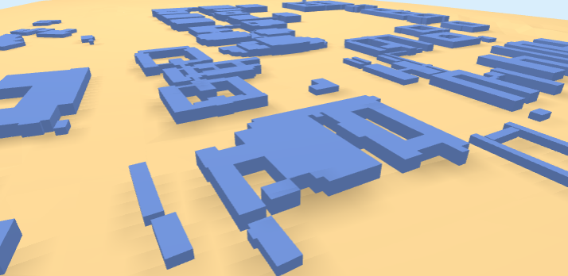

<h1 align="center">LoD1 3D City Model from volunteered public data  
  and a raster Digital Elevation Model.
</h1> 

  

This repository is inspired by [3dfier](https://tudelft3d.github.io/3dfier/minimal_data_requirements.html); product of the [3D geoinformation group](https://3d.bk.tudelft.nl/)  at [TUDelft](https://www.tudelft.nl/)

Its paper: `Ledoux H, Biljecki F, Dukai B, Kumar K, Peters R, Stoter J, and Commandeur T (2021). 3dfier: automatic reconstruction of 3D city models. Journal of Open Source Software, 6(57), 2866.` , [website](https://tudelft3d.github.io/3dfier/index.html) and [github](https://github.com/tudelft3d/3dfier) are available.
#
We generate a Level-of-Detail 1 (LoD1) 3D City Model (buildings and terrain) from [OpenStreetMap](https://en.wikipedia.org/wiki/OpenStreetMap) (osm) with elevation from a raster Digital Elevation Model (DEM).

---

**NOTE:** *This workflow is not meant to scale.*  
Requests for an extreme amount of data from the [osm](https://en.wikipedia.org/wiki/OpenStreetMap) server is destructive to the entire community. Village, communities with populations less-than 10 000 and campus analysis only please. For larger areas consider harvesting data via `.pbf` ([geofabric](https://download.geofabrik.de/index.html) or [planet](https://planet.osm.org/)) - raise an issue and we can work on an alternate processing strategy.

---

Set parameters with a basic [json](https://github.com/AdrianKriger/osm_LoD1_3DCityModel/blob/main/osm3Dcput_param.json) to execute [osm3DCode](https://github.com/AdrianKriger/osm_LoD1_3DCityModel/blob/main/osm3DCode.py) through [osm3DMain](https://github.com/AdrianKriger/osm_LoD1_3DCityModel/blob/main/osm3DMain.py).  

**Input** a raster DEM. Script will call the osm server.  
**Output** includes:  
&nbsp;&nbsp;&nbsp;&nbsp;&nbsp;i. a 2.75D surface mesh *(buildings connected to terrain)*;  
&nbsp;&nbsp;&nbsp;&nbsp;&nbsp;ii. a semantically rich LoD1 City Model *(information rich building models seperate from the ground; but when connected to the terrain   form a water-tight surface*)*; and  
&nbsp;&nbsp;&nbsp;&nbsp;&nbsp;iii. an interactive .html which you can navigate and query.

If your interest is a dynamic visualization only; [interactiveOnly.ipynb](https://github.com/AdrianKriger/osm_LoD1_3DCityModel/blob/main/interactiveOnly.ipynb) will produce iii) without i) and ii).

* *the goal is a topologically correct surface. I have not tested this for all possibilities. If the result you achive is not; you are welcome to raise an issue. I depend on you to help me improve.* 

Please read the [Good-To-Know](https://github.com/AdrianKriger/osm_LoD1_3DCityModel/blob/main/Good-To-Know.md).
