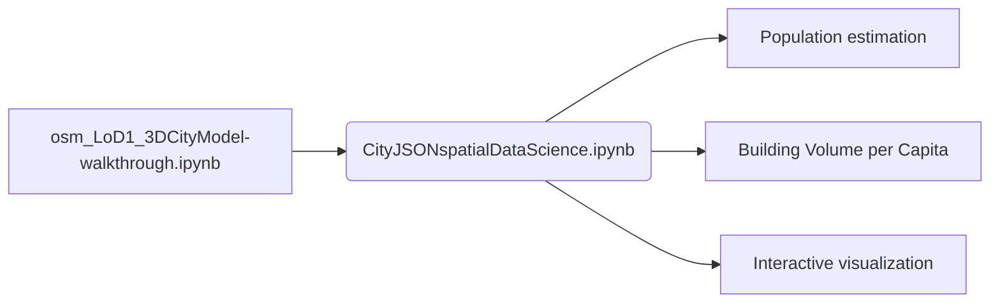

<h1 align="center">LoD1 3D City Model from volunteered public data and a raster Digital Elevation Model.
</h1> 

  

We generate a Level-of-Detail 1 (LoD1) 3D City Model (buildings and terrain) from [OpenStreetMap](https://en.wikipedia.org/wiki/OpenStreetMap) (osm) contributions with elevation from a raster [Digital Elevation Model](https://en.wikipedia.org/wiki/Digital_elevation_model) (DEM).

There are two procesing strategies

| [Village/Campus](https://github.com/AdrianKriger/osm_LoD1_3DCityModel/tree/main/village_campus) | [District](https://github.com/AdrianKriger/osm_LoD1_3DCityModel/tree/main/districts)    *[This is on hold]* |
| :-----: | :-----: |
| If your Area-of-Interest (aoi) has less than   2 500 buildings, you are welcome to choose [village/campus](https://github.com/AdrianKriger/osm_LoD1_3DCityModel/tree/main/village_campus) | Please choose [District](https://github.com/AdrianKriger/osm_LoD1_3DCityModel/tree/main/districts) if your aoi has more than 2 500 buildings |
---
<!-- -->
**Input** a raster DEM. Script will call for the [osm contributions](https://www.openstreetmap.org/about#:~:text=OpenStreetMap%20is%20built%20by%20a,more%2C%20all%20over%20the%20world.).  
**Output** includes:  
<!--&nbsp;&nbsp;&nbsp;&nbsp;&nbsp;i. a 2.75D surface mesh *(buildings connected to terrain)*;-->  
&nbsp;&nbsp;&nbsp;&nbsp;&nbsp;i. a topologically correct LoD1 City Model *(information rich building models seperate from the ground; but when connected to the terrain   form a water-tight surface*)*;  
&nbsp;&nbsp;&nbsp;&nbsp;&nbsp;ii. one use case of 3D city models. Population estimation and the calculation of [Building Volume per Capita](https://www.researchgate.net/publication/343185735_Building_Volume_Per_Capita_BVPC_A_Spatially_Explicit_Measure_of_Inequality_Relevant_to_the_SDGs); and  
&nbsp;&nbsp;&nbsp;&nbsp;&nbsp;iii. an interactive .html which you can navigate and query.

* *the goal is a model that conforms to the ISO 19107 standard [connecting and planar surfaces, correct orientation of the surfaces and watertight volumes]. I have not tested this for all possibilities. If the result you achieve is not; you are welcome to raise an issue. I depend on you to help me improve.* 
&nbsp;

&nbsp;
[Documentation](https://adriankriger.github.io/osm_LoD1_3DCityModel/) is available. The [announcement](https://github.com/AdrianKriger/osm_LoD1_3DCityModel/discussions/22#discussion-4781443) is noteworthy.

**For a quickstart** *(and to see the value and usefulness of a 3D City Model)*:

---

<!--This repository is inspired by [3dfier](https://tudelft3d.github.io/3dfier/minimal_data_requirements.html); product of the [3D geoinformation group](https://3d.bk.tudelft.nl/) at [TUDelft](https://www.tudelft.nl/)-->
Paper currently under review with the [South African Journal of Geomatics](http://www.sajg.org.za/index.php/sajg/issue/archive)

Its [paper](https://joss.theoj.org/papers/10.21105/joss.02866): `Ledoux H, Biljecki F, Dukai B, Kumar K, Peters R, Stoter J, and Commandeur T (2021). 3dfier: automatic reconstruction of 3D city models. Journal of Open Source Software, 6(57), 2866.` [website](https://tudelft3d.github.io/3dfier/index.html) and [github](https://github.com/tudelft3d/3dfier) are available.

---
