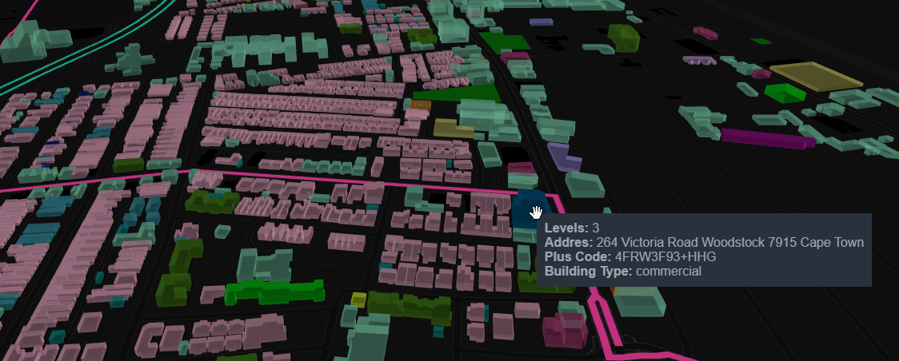
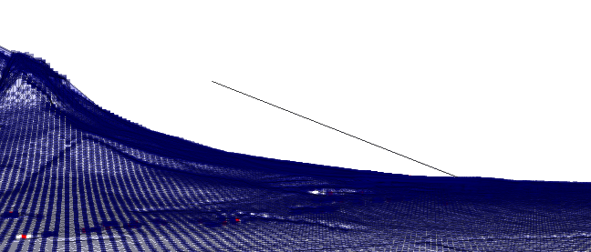
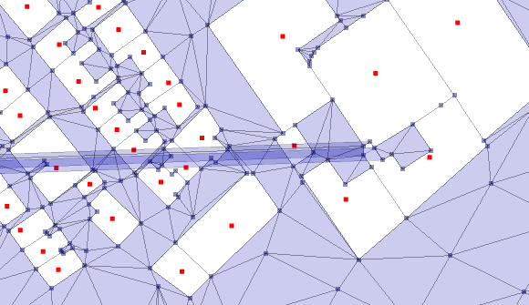

# Good-To-Know

<ins>**Parameters:**</ins>  
a) In an attempt to make the solution available to the broadest possible audience we start with national [.osm.pbf](https://wiki.openstreetmap.org/wiki/PBF_Format) and trim with a [osm.poly](https://wiki.openstreetmap.org/wiki/Osmosis/Polygon_Filter_File_Format) via [osmconvert](https://wiki.openstreetmap.org/wiki/Osmconvert). If your Area-of-Interest (aoi) does not need to a less substantial osm.pbf; set ["trim": 'no'](https://github.com/AdrianKriger/osm_LoD1_3DCityModel/blob/main/districts/extra/osm3DdistrictsKaya_param.json#L6) and leave the osm.pbf as is. ["trim": 'yes'](https://github.com/AdrianKriger/osm_LoD1_3DCityModel/blob/main/districts/extra/osm3DdistrictsTshwane_param.json#L2-L11) otherwise ~ ([issue #4](https://github.com/AdrianKriger/osm_LoD1_3DCityModel/issues/4)). An extensive range of [osm.poly](https://wiki.openstreetmap.org/wiki/Osmosis/Polygon_Filter_File_Format) files can be accessed [here](https://github.com/JamesChevalier/cities).  
b) ["update"](https://github.com/AdrianKriger/osm_LoD1_3DCityModel/blob/main/districts/osm3Ddistricts_param.json#L3) must be `"True"` to download the [appropriate osm.pbf](https://github.com/AdrianKriger/osm_LoD1_3DCityModel/blob/main/districts/osm3Ddistricts_param.json#L2); therafter `"False"` will use that file.  
c) Your ["Focus_area"](https://github.com/AdrianKriger/osm_LoD1_3DCityModel/blob/main/districts/osm3Ddistricts_param.json#L3) must exist in osm as a defined [boundary=administrative](https://wiki.openstreetmap.org/wiki/Tag:boundary%3Dadministrative). It can be one or comma seperated. So for example should you wish to explore the twelve census wards (tracts) of [Khayelitsha](https://en.wikipedia.org/wiki/Khayelitsha) (population: aprox. 390 000) you would go:  
["Cape Town Ward 18,Cape Town Ward 87,Cape Town Ward 90,<    and so on  >,Cape Town Ward 97,Cape Town Ward 95"](https://github.com/AdrianKriger/osm_LoD1_3DCityModel/blob/main/districts/extra/osm3DdistrictsKaya_param.json#L11).  
d) Define [metadata](https://github.com/AdrianKriger/osm_LoD1_3DCityModel/blob/main/osm3Dcput_param.json#L22-L30) for the City Model. Without it the dataset has no value. [CityJSON Specifications](https://www.cityjson.org/specs/1.1.0/#metadata) are pretty comprehensive.  
e) Create a dynamic .html with [interactiveOnly](https://github.com/AdrianKriger/osm_LoD1_3DCityModel/blob/main/districts/interactiveOnly.ipynb). The [Jupyter](https://jupyter.org/) environment allows for easy customization of the final product. The static png below (Fig 1.) illustrates building stock differentiated through color. A school, housing, retail, healthcare and community focused facilities are easily identified. Additional features unique to an aoi can also be included. Here parks and bus rapid transit routes have been added. The tooltips provide an additional means to convey information. An interactive version can be found [here](https://adriankriger.github.io/osm_LoD1_3DCityModel/docs/interactive/).

  

  

    Fig 1. An example of how the interactive visualization can be customized through coloring the building stock (school, retail, housing, commercial, etc.) and including aoi specific features (parks, bus rapid transit, etc.) while the tooltips showcase the underlying data.

f) While [interactiveOnly](https://github.com/AdrianKriger/osm_LoD1_3DCityModel/blob/main/districts/interactiveOnly.ipynb) should execute successfully in any area; the [CityJSON](https://www.cityjson.org/) will not when an aoi extend's into NoData (typically the ocean). This means [these types of areas](https://www.openstreetmap.org/relation/6580101#map=13/-33.9170/18.4359) will fail to produce a LoD1 3D City Model.

<ins>**Accuracy:**</ins>  
dem - in South Africa if you are using the [National geo-spatial information](http://www.ngi.gov.za/) raster dem the [resolution is 25-m at 3-m accurate](https://www.ee.co.za/wp-content/uploads/2015/08/Julie-Verhulp.pdf).  
vector - A [snap routine](https://github.com/AdrianKriger/osm_LoD1_3DCityModel/blob/main/osm3DCode.py#L231-L238) reduces the number of vertices within 0.2-m on the osm vector layer. 

<ins>**Precision:**</ins>  
I've chosen to process in Universal Transverse Mercator 34 South. You can choose another [crs](https://github.com/AdrianKriger/osm_LoD1_3DCityModel/blob/main/osm3Dcput_param.json#L6). Be aware a floating-point precision error might arise.

<ins>**Building Heights:**</ins>  
The osm tag `building:level` is taken as a [proxy for the height of a building](https://wiki.openstreetmap.org/wiki/Key:building:levels). The calculation is simply `building:level * 2.8 + 1.3`. If a structure does not have a `building:level` tag no LoD1 model is created. Vector data is through [&copy; OpenStreetMap contributors](https://www.openstreetmap.org/copyright). All data from OpenStreetMap is licensed under the [OpenStreetMap License](https://wiki.osmfoundation.org/wiki/Licence).

<ins>**Raster dem:**</ins>  
a) The [osm3Ddistricts_param.json](https://github.com/AdrianKriger/osm_LoD1_3DCityModel/blob/main/districts/osm3Ddistricts_param.json#L13) defines the raster I used in the example. [...](...) defines another. These datasets, and more, are available from the [CD:NGI Geoportal](http://www.ngi.gov.za/index.php/online-shop/what-is-itis-portal); State copyright reserved. The Chief Directorate: National Geospatial Information is a branch of the [Department Rural Development and Land Reform](https://www.drdlr.gov.za/sites/Internet/Branches/NationalGeomaticsAndManagementServices/Pages/National-Geo-Spatial-Information.aspx) and is a key contributor to the [South African Spatial Data Infrustructure](http://www.sasdi.gov.za/sites/SASDI/Pages/Home.aspx).  
b) The script handles the mosaic (merge), projection and clipping to an aoi. Similar to ["Focus_area"](https://github.com/AdrianKriger/osm_LoD1_3DCityModel/blob/main/districts/osm3Ddistricts_param.json#L3) *---and to continue with the [Khayelitsha](https://en.wikipedia.org/wiki/Khayelitsha) example---* if more than one raster dem is necessary the ["in_raster" parameter]() would be:  
`"./raster/LO19_050M_3418BA.tif, ./raster/LO19_050M_3318DC.tif"`. Two should be enough. In the event you need more the script must to change. You are welcome to raise an issue.

<ins>**Triangulation:**</ins>  
a) [PyVista](https://www.pyvista.org/) is [built-in](https://github.com/AdrianKriger/osm_LoD1_3DCityModel/blob/main/osm3DCode.py#L440-L466) and will execute after the triangulation; before the 3D City Model is created. In addition to verifying the building footprints have been removed, from the surface, you need to check for a spike or two. Generally if you trace this to its root *---and open in an [osm editor](https://wiki.openstreetmap.org/wiki/Editors)---* you'll discover buildings crossing each other ~ Fig.2. The [constrained Delaunay triangulation](https://rufat.be/triangle/definitions.html) knows there are lines (walls) and expects a vertex where they intersect. There is none and the result is a spike. Drop a [node](https://wiki.openstreetmap.org/wiki/Node) to correct the topology. *We are transforming volunteered public data into a value-added product. Alchemy is a process. Please be patient.*

    

 

    Fig 2. - left illustrates a spike. - right traces the challenge to the root.

b) Shewchuck's [Triangle](https://www.cs.cmu.edu/~quake/triangle.html) may not be sold or included in commercial products without a license.  

<ins>**CityJSON attributes:**</ins>  
a) A selection of the [osm tags](https://wiki.openstreetmap.org/wiki/Map_features#Building) are simply copied to the 3D Building Models verbatim; with the exception of the address. To reduce the complexty of the [Key:addr](https://wiki.openstreetmap.org/wiki/Key:addr#Detailed_subkeys) each component is concatenated into one [string](https://en.wikibooks.org/wiki/Python_Programming/Variables_and_Strings#String) following, as closely as possible, the [ISO 19160-1:2015(en) Addressing](https://www.iso.org/obp/ui/#iso:std:iso:19160:-1:ed-1:v1:en) standard. A typical address will thus read: `housenumber street suburb postalcode city province`. Should the building be an apartment the [unit range](https://wiki.openstreetmap.org/wiki/Key:addr:flats) will prepend the address.  
The [code](https://github.com/AdrianKriger/osm_LoD1_3DCityModel/blob/main/osm3DCode.py#L187-L248) can easily be extended to meet your specific needs. no osm tag = no attribute.  
b) Google ['plus codes'](https://maps.google.com/pluscodes/) are included at a precision of [11 characters - 3.5-meter block size](https://en.wikipedia.org/wiki/Open_Location_Code) (e.g. 4FRW3J9R+892Q); referenced to the [`representative_point()`](https://shapely.readthedocs.io/en/stable/manual.html) of buildings. - in Fig 2. this would be the red dot.  
c) Fig. 3 illustrates the typical semantic data connected to the 3D City Model. *Visualization: [ninja](https://ninja.cityjson.org/#)*

  

  

    Fig 3. An example of the CityJSON attributes. 

<ins>**Alternatives:**</ins>  
[Cesium](https://cesium.com/), [mapbox](https://www.mapbox.com/), [deck.gl](https://deck.gl/) and [3dbuildings](https://3dbuildings.com/) will stream 3D tiles to your hearts content.

<ins>**[The Penultimate Truth:](https://en.wikipedia.org/wiki/The_Penultimate_Truth)**</ins>  
Its not very efficient. A few [timing metrics](https://github.com/AdrianKriger/osm_LoD1_3DCityModel/blob/main/districts/osm3DMainDistricts.py#L84-L86) are available to help you decide -> run and wait or run, walk away and come back later?
