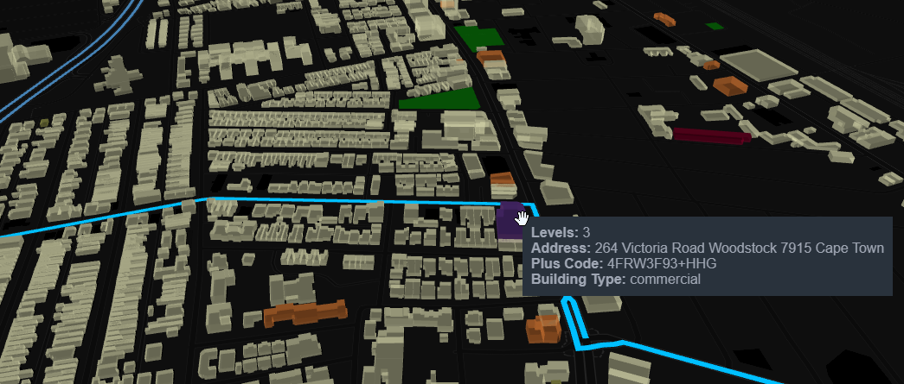

# Good-To-Know

<ins>**Parameters:**</ins>  
a) ["update"](https://github.com/AdrianKriger/osm_LoD1_3DCityModel/blob/main/districts/osm3Ddistricts_param.json#L3) must be `"True"` to download the appropriate osm.pbf; therafter `"False"` will use that file.  
b) Your ["Focus_area"](https://github.com/AdrianKriger/osm_LoD1_3DCityModel/blob/main/districts/osm3Ddistricts_param.json#L3) must exist in osm as a defined [boundary=administrative](https://wiki.openstreetmap.org/wiki/Tag:boundary%3Dadministrative). It can be one or comma seperated. So for example should you wish to explore the nine census wards (tracts) of [Khayelitsha](https://en.wikipedia.org/wiki/Khayelitsha) (population: aprox. 390 000) you would go:  
`"Cape Town Ward 18,Cape Town Ward 87,Cape Town Ward 90,Cape Town Ward 89,Cape Town Ward 91,Cape Town Ward 93,Cape Town Ward 94,Cape Town Ward 92,Cape Town Ward 98,Cape Town Ward 97,Cape Town Ward 95"`.  
c) Define [metadata](https://github.com/AdrianKriger/osm_LoD1_3DCityModel/blob/main/osm3Dcput_param.json#L22-L30) for the City Model. Without it the dataset has no value.    
d) Although interactive is set to ['True'](https://github.com/AdrianKriger/osm_LoD1_3DCityModel/blob/main/osm3Dcput_param.json#L34); I recommend 'False'. Create the .html with [interactiveOnly](https://github.com/AdrianKriger/osm_LoD1_3DCityModel/blob/main/interactiveOnly.ipynb). The [Jupyter](https://jupyter.org/) environment allows for easy customization of the final product. The static png below (Fig 1.) illustrates building stock differentiated through color. A school, housing, retail, healthcare and community focused facilities are easily identified. Additional features unique to an aoi can also be included. Here farmland, streams, recreational spaces and bus rapid transit routes have been added *- you are thus limited only through data and your imagination*.

  

  

    Fig 1. An example of how the interactive visualization can be customized through coloring the building stock (school, retail, housing, social development facilities, etc.) and including aoi specific features (recreational ground, agricultural land, etc.).

<ins>**Accuracy:**</ins>  
dem - in South Africa if you are using the [National geo-spatial information](http://www.ngi.gov.za/) raster dem the [resolution is 25-m at 3-m accurate](https://www.ee.co.za/wp-content/uploads/2015/08/Julie-Verhulp.pdf).  
vector - A [snap routine](https://github.com/AdrianKriger/osm_LoD1_3DCityModel/blob/main/osm3DCode.py#L231-L238) reduces the number of vertices within 0.2-m on the osm vector layer. 

<ins>**Precision:**</ins>  
I've chosen to process in Universal Transverse Mercator 33 South. You can choose another [crs](https://github.com/AdrianKriger/osm_LoD1_3DCityModel/blob/main/osm3Dcput_param.json#L6). Be aware a floating-point precision error might arise.

<ins>**Building Heights:**</ins>  
The osm tag `building:level` is taken as a [proxy for the height of a building](https://wiki.openstreetmap.org/wiki/Key:building:levels). The calculation is simply `building:level * 2.8 + 1.3`. If a structure does not have a `building:level` tag no LoD1 model is created. Vector data is through [&copy; OpenStreetMap contributors](https://www.openstreetmap.org/copyright). All data from OpenStreetMap is licensed under the [OpenStreetMap License](https://wiki.osmfoundation.org/wiki/Licence).

<ins>**Raster dem:**</ins>  
a) The [osm3Dcput_param.json](https://github.com/AdrianKriger/osm_LoD1_3DCityModel/blob/main/extra/osm3Dcput_param.json#L15) defines the raster I used in the example. [osm3Dmamre_param.json](https://github.com/AdrianKriger/osm_LoD1_3DCityModel/blob/main/osm3Dmamre_param.json#L15) defines another. These datasets, and more, are available from the [CD:NGI Geoportal](http://www.ngi.gov.za/index.php/online-shop/what-is-itis-portal); State copyright reserved. The Chief Directorate: National Geospatial Information is a branch of the [Department Rural Development and Land Reform](https://www.drdlr.gov.za/sites/Internet/Branches/NationalGeomaticsAndManagementServices/Pages/National-Geo-Spatial-Information.aspx) and is a key contributor to the [South African Spatial Data Infrustructure](http://www.sasdi.gov.za/sites/SASDI/Pages/Home.aspx).  
b) The script handles the projection and clipping to an aoi. If your focus area falls on the boundary of two raster sheets - you are welcome to raise an issue so we can expand the functionality to `glob` a folder, reproject, **merge**, clip and continue. Bear in mind the **NOTE.**

<ins>**Triangulation:**</ins>  
a) [PyVista](https://www.pyvista.org/) is [built-in](https://github.com/AdrianKriger/osm_LoD1_3DCityModel/blob/main/osm3DCode.py#L440-L466) and will execute after the triangulation; before the 3D City Model is created. This is to visualize the terrain. I have left [line 298 of osm3DCode](https://github.com/AdrianKriger/osm_LoD1_3DCityModel/blob/main/osm3DCode.py#L298) as an aid.
You need to verify if the building footprints have been removed from the surface. The two images illustrate an example were a specific vector had to be accounted for or the result would not be topologically correct (water-tight with no holes nor gaps).

    

 

    Fig 2. - left illustrates the building footprint removed from the terrain. - right shows the vertices accounted for; but the ground remains.

b) Shewchuck's [Triangle](https://www.cs.cmu.edu/~quake/triangle.html) may not be sold or included in commercial products without a license.  

<ins>**CityJSON attributes:**</ins>  
a) [osm tags](https://wiki.openstreetmap.org/wiki/Map_features#Building) are simply copied to the 3D Building Models verbatim; with the exception of the address. To reduce the complexty of the [Key:addr](https://wiki.openstreetmap.org/wiki/Key:addr#Detailed_subkeys) each component is concatenated into one [string](https://en.wikibooks.org/wiki/Python_Programming/Variables_and_Strings#String) following, as closely as possible, the [ISO 19160-1:2015(en) Addressing](https://www.iso.org/obp/ui/#iso:std:iso:19160:-1:ed-1:v1:en) standard. A typical address will thus read: `housenumber street suburb postalcode city province`. Should the building be an apartment the [unit range](https://wiki.openstreetmap.org/wiki/Key:addr:flats) will prepend the address.  
The [code](https://github.com/AdrianKriger/osm_LoD1_3DCityModel/blob/main/osm3DCode.py#L187-L248) can easily be extended to meet your specific needs. no osm tag = no attribute.  
b) Google ['plus codes'](https://maps.google.com/pluscodes/) are included at a precision of [11 characters - 3.5-meter block size](https://en.wikipedia.org/wiki/Open_Location_Code) (e.g. 4FRW3J9R+892Q); referenced to the [`representative_point()`](https://shapely.readthedocs.io/en/stable/manual.html) of buildings. - in Fig 2. this would be the red dot.  
c) Fig. 3 illustrates the typical semantic data connected to the 3D City Model. *Visualization: [ninja](https://ninja.cityjson.org/#)*

  

  

    Fig 3. An example of the CityJSON attributes. 

<ins>**Alternatives:**</ins>  
[BlenderGIS](https://github.com/domlysz/BlenderGIS) and [QGIS](https://qgis.org/en/site/) offers some (if not all and more) of this functionality.

<ins>**[The Penultimate Truth:](https://en.wikipedia.org/wiki/The_Penultimate_Truth)**</ins>  
Its not very efficient.

<ins>**Lastly:**</ins>  
Please don't burden the osm server with requests for an extreme amount of data.
